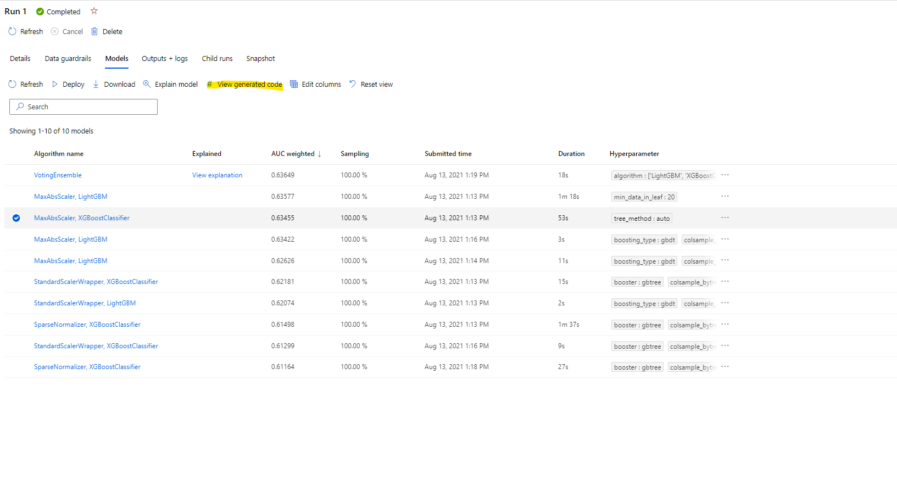
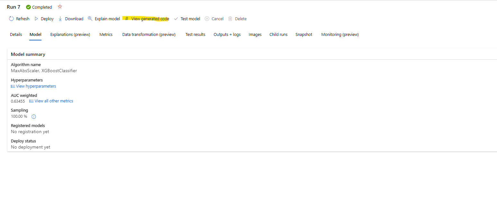

# AutoML Code Gen Preview

## Setup
To start using the AutoML Code Gen Preview, the feature must be enabled when submitting the experiment.

Please note that these instructions may be updated as needed during the preview.

### SDK
When using AutoML via the SDK, you will need to ensure that you call `experiment.submit()` from a Conda environment that contains the private preview SDK. In addition, this feature is only enabled for experiments running on a remote compute target.

To create a new Conda environment with the private preview SDK, make sure you have Anaconda or Miniconda installed, then run these commands:
```bash
conda env create -f automl_codegen_preview.yml
conda activate automl_codegen_preview
```

To update the private preview SDK when a new version is released, run these commands:
```bash
conda activate automl_codegen_preview
pip install --upgrade --extra-index-url https://azuremlsdktestpypi.azureedge.net/codegen "azureml-train-automl<0.1.50"
```

You will know if you are using a private preview version by running the following code snippet:

```python
from azureml.core.conda_dependencies import CondaDependencies
print(CondaDependencies.sdk_origin_url())
```

The return value should be `https://azuremlsdktestpypi.azureedge.net/codegen`.

In addition, before submitting your experiment, you will need to set the following flag in AutoMLConfig:
* `enable_code_generation=True`

Thus, your AutoMLConfig will look something like this:

```python
config = AutoMLConfig(
    task="classification",
    training_data=data,
    label_column_name="label",
    compute_target=compute_target,
    enable_code_generation=True
)
```

**IMPORTANT NOTE:** Due to temporal dependency to indexed packages needed to make code-gen work, before training with "enable_code_generation=True" the process will need to create a specific Docker image for it, which causes significant delay on the start of the featurization and training (around 15 min). This issue is temporal and will be eliminated when moving to PUBLIC PREVIEWS and more mature PRIVATE PREVIEWS. 

You can retrieve the code gen artifacts via the UI (see _Viewing Code Generation from the UI_), or by running the following code:

```python
remote_run.download_file("outputs/generated_code/script.py", "script.py")
remote_run.download_file("outputs/generated_code/script_run_notebook.ipynb", "script_run_notebook.ipynb")
```

### UI
**Enabling Code Generation from the UI:** 
_NOTE: Currently, when code gen is enabled via the UI, the public version of the SDK (from PyPi) will be used. Thus, you may be missing bugfixes or additions not available in the public version. This will be addressed in the future._

Trigger an Automated ML run using the following url: 

[https://ml.azure.com/automl/startrun?wsid=/subscriptions/{subscriptionId}/resourceGroups/{resourceGroupName}/providers/Microsoft.MachineLearningServices/workspaces/{workspaceName}&flight=AdditionalAmlSetting=false](https://ml.azure.com/automl/startrun?wsid=/subscriptions/%7bsubscriptionId%7d/resourceGroups/%7bresourceGroupName%7d/providers/Microsoft.MachineLearningServices/workspaces/%7bworkspaceName%7d&flight=AdditionalAmlSetting=false)

Make sure to fill in the fields in the { }. The important addition here is the `&flight=AdditionalAmlSetting=false` at the end of the url.

## Viewing Code Generation from the UI

Once a child run is completed, you will be able to view the generated code through the UI by clicking the “View generated code” button which can be viewed in either the Models tab in the parent run page (see first image) or on the top of the child run page (see second image).





After clicking this button, you will be redirected to the Notebooks portal extension where you can run the generated code.

## Generated Code Walkthrough: Notebook and .py file code

Please, review this additional walkthrough example in order to understand the generated code:

[Generated Code Walkthrough: Notebook and .py file code](https://github.com/Azure/automl-codegen-preview/blob/main/example/EXAMPLE.md)


## Known issues/limitations
Listed below are the currently known issues and limitations of code generation.

* When running with a private preview SDK, an image build step is currently required before the experiment starts. This is handled for you, but will add to overall experiment runtime. The image build step will be removed in a future release when using a curated environment in production SDK instead of private indexes. This could be done even when using stable publicly/production Previews.  
* Currently only classification, regression, and forecasting tasks are supported.
* Streaming datasets are not supported.
* DNN trained models are not supported.
* `DataTransformer._engineered_feature_names_class` is currently loaded from a bytestring to map raw to engineered feature names, which may be problematic if the list of featurizers changes.

## Contributing

This project welcomes contributions and suggestions.  Most contributions require you to agree to a
Contributor License Agreement (CLA) declaring that you have the right to, and actually do, grant us
the rights to use your contribution. For details, visit https://cla.opensource.microsoft.com.

When you submit a pull request, a CLA bot will automatically determine whether you need to provide
a CLA and decorate the PR appropriately (e.g., status check, comment). Simply follow the instructions
provided by the bot. You will only need to do this once across all repos using our CLA.

This project has adopted the [Microsoft Open Source Code of Conduct](https://opensource.microsoft.com/codeofconduct/).
For more information see the [Code of Conduct FAQ](https://opensource.microsoft.com/codeofconduct/faq/) or
contact [opencode@microsoft.com](mailto:opencode@microsoft.com) with any additional questions or comments.

## Trademarks

This project may contain trademarks or logos for projects, products, or services. Authorized use of Microsoft 
trademarks or logos is subject to and must follow 
[Microsoft's Trademark & Brand Guidelines](https://www.microsoft.com/en-us/legal/intellectualproperty/trademarks/usage/general).
Use of Microsoft trademarks or logos in modified versions of this project must not cause confusion or imply Microsoft sponsorship.
Any use of third-party trademarks or logos are subject to those third-party's policies.
